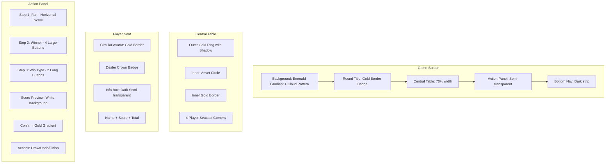

# Retro Luxury Mahjong Table UI Redesign Plan

## Executive Summary

This document outlines a comprehensive UI redesign plan to transform the current mahjong game interface into a retro luxury style inspired by Hong Kong mahjong aesthetics. The design features deep emerald green gradients, gold accents, and simulates a real jade green velvet table with metal frame.

---

## 1. Current State Analysis

### 1.1 Component Structure

```
app/game.tsx
├── SafeAreaView (bg-green-800)
│   └── ScrollView
│       ├── MahjongTable
│       │   ├── Round Info Badge
│       │   ├── Table Background (circular)
│       │   ├── PlayerSeat x4 (positioned absolutely)
│       │   └── Center Indicator
│       └── ActionPanel
│           ├── FanSelector
│           ├── WinnerSelector
│           ├── WinTypeSelector
│           ├── Score Preview
│           ├── Confirm Button
│           └── Action Buttons (Draw/Undo/Finish)
```

### 1.2 Current Styling Issues

| Component | Current State | Issue |
|-----------|--------------|-------|
| Background | Flat `bg-green-800` | No gradient, no depth |
| Table | Simple `bg-green-700/50` circle | No texture, no gold ring |
| Player Cards | Rectangular with basic border | No circular avatar, no luxury feel |
| Round Title | Small badge at top | Not prominent, no gold glow |
| Action Panel | Basic green panel | No step hierarchy, no gold accents |
| Buttons | Yellow/green/red flat | No 3D depth, no gold highlight system |
| Typography | Default fonts | No consistent Chinese typography |

---

## 2. New Color Palette Definition

### 2.1 Tailwind Config Extensions

```javascript
// tailwind.config.js - Add to theme.extend.colors
colors: {
  // Primary Emerald Green Palette
  emerald: {
    950: '#0a1f0a',    // Darkest - top gradient
    900: '#0f2f0f',    // Dark base
    800: '#1a4a1a',    // Mid-dark
    700: '#2d5a2d',    // Mid
    600: '#3d7a3d',    // Mid-light
    500: '#4a8f4a',    // Light
    400: '#6ab06a',    // Lighter
    300: '#8fc88f',    // Light accent
  },
  // Gold Accent Palette
  gold: {
    900: '#7a5c00',    // Dark gold
    800: '#996600',    // Bronze
    700: '#b88600',    // Dark gold accent
    600: '#d4a500',    // Mid gold
    500: '#e6b800',    // Standard gold
    400: '#f0c800',    // Bright gold
    300: '#ffd700',    // Gold highlight
    200: '#ffdf4d',    // Light gold
    100: '#fff0a3',    // Pale gold
  },
  // Luxury UI Colors
  luxury: {
    velvet: '#1a3d1a',     // Deep velvet green
    felt: '#2d5a2d',       // Table felt
    shadow: '#0a1a0a',     // Deep shadow
    highlight: '#4a7a4a',  // Subtle highlight
    goldRing: '#d4a500',   // Metal gold
    goldShine: '#ffd700',  // Shiny gold
  },
  // Score Colors
  score: {
    win: '#22c55e',       // Green for positive
    lose: '#ef4444',      // Red for negative
    neutral: '#ffffff',   // White for zero
  },
}
```

### 2.2 Custom CSS Utilities

```css
/* global.css - Add custom utilities */
@tailwind base;
@tailwind components;
@tailwind utilities;

@layer components {
  /* Gold gradient for buttons/elements */
  .gold-gradient {
    background: linear-gradient(135deg, #d4a500 0%, #ffd700 50%, #d4a500 100%);
  }
  
  /* Emerald gradient for background */
  .emerald-gradient {
    background: linear-gradient(180deg, #0a1f0a 0%, #1a4a1a 50%, #2d5a2d 100%);
  }
  
  /* Velvet texture overlay */
  .velvet-texture {
    background-image: 
      radial-gradient(circle at 50% 50%, transparent 0%, rgba(0,0,0,0.3) 100%),
      repeating-linear-gradient(
        0deg,
        transparent,
        transparent 2px,
        rgba(0,0,0,0.03) 2px,
        rgba(0,0,0,0.03) 4px
      );
  }
  
  /* Gold ring shadow */
  .gold-ring-shadow {
    box-shadow: 
      0 0 0 4px rgba(212, 165, 0, 0.8),
      0 0 20px rgba(212, 165, 0, 0.4),
      inset 0 0 30px rgba(0, 0, 0, 0.3);
  }
  
  /* Selected element glow */
  .selected-glow {
    box-shadow: 
      0 0 15px rgba(255, 215, 0, 0.6),
      0 4px 8px rgba(0, 0, 0, 0.3);
    transform: scale(1.05);
  }
  
  /* Card semi-transparent dark */
  .card-dark {
    background: rgba(10, 20, 10, 0.75);
    backdrop-filter: blur(4px);
  }
}

@layer utilities {
  /* Text shadow for outlined effect */
  .text-outline {
    text-shadow: 
      -1px -1px 0 #000,
      1px -1px 0 #000,
      -1px 1px 0 #000,
      1px 1px 0 #000;
  }
  
  /* Gold text glow */
  .text-gold-glow {
    text-shadow: 0 0 10px rgba(255, 215, 0, 0.5);
  }
}
```

---

## 3. Component-by-Component Implementation Plan

### 3.1 Main Game Screen (`app/game.tsx`)

**Current:**
```tsx
<SafeAreaView className="flex-1 bg-green-800" edges={['top']}>
```

**New Design:**
```tsx
<SafeAreaView className="flex-1 emerald-gradient" edges={['top']}>
  {/* Cloud pattern overlay - optional SVG */}
  <View className="absolute inset-0 opacity-5">
    {/* CloudPattern SVG */}
  </View>
  
  <ScrollView className="flex-1" contentContainerStyle={{ flexGrow: 1 }}>
    {/* MahjongTable */}
    {/* ActionPanel */}
    {/* BottomNavigationBar - NEW */}
  </ScrollView>
</SafeAreaView>
```

**Changes Required:**
- Replace flat `bg-green-800` with `emerald-gradient`
- Add optional cloud pattern overlay
- Add new BottomNavigationBar component

---

### 3.2 MahjongTable Component (`src/components/game/MahjongTable.tsx`)

**Current Structure:**
- Round info badge at top
- Square aspect ratio container
- Simple circular background
- 4 player seats positioned absolutely
- Center text indicator

**New Design:**

```tsx
<View className="flex-1 items-center justify-center">
  {/* Round Title - Centered at top of table */}
  <View className="bg-luxury-velvet/80 px-6 py-2 rounded-full mb-4 border-2 border-gold-500">
    <Text className="text-white text-xl font-bold text-outline">
      東風圈 / 第2局
    </Text>
  </View>

  {/* Central Round Table */}
  <View className="relative w-[70%] aspect-square items-center justify-center">
    {/* Outer Gold Ring */}
    <View className="absolute inset-0 rounded-full gold-gradient gold-ring-shadow" />
    
    {/* Inner Green Velvet Circle */}
    <View className="absolute inset-2 rounded-full bg-luxury-felt velvet-texture">
      {/* Inner Gold Border */}
      <View className="absolute inset-1 rounded-full border-4 border-gold-500/60" />
    </View>
    
    {/* Player Seats - 4 corners */}
    {/* North - Top */}
    <View className="absolute -top-4">
      <PlayerSeat player={northPlayer} position="top" />
    </View>
    
    {/* South - Bottom */}
    <View className="absolute -bottom-4">
      <PlayerSeat player={southPlayer} position="bottom" />
    </View>
    
    {/* West - Left */}
    <View className="absolute -left-4">
      <PlayerSeat player={westPlayer} position="left" />
    </View>
    
    {/* East - Right */}
    <View className="absolute -right-4">
      <PlayerSeat player={eastPlayer} position="right" />
    </View>
  </View>
</View>
```

**Key Changes:**
| Element | Current | New |
|---------|---------|-----|
| Table size | `max-w-md` | `w-[70%]` of screen |
| Background | `bg-green-700/50` | Layered gold ring + velvet texture |
| Round title | Small badge | Prominent with gold border |
| Center text | Shows "麻將桌" | Remove or make subtle |

---

### 3.3 PlayerSeat Component (`src/components/game/PlayerSeat.tsx`)

**Current Design:**
- Rectangular card
- Basic border (yellow for dealer)
- Wind badge + name + score

**New Design:**

```tsx
<View className="items-center">
  {/* Circular Avatar with Gold Border */}
  <View className={`
    w-16 h-16 rounded-full items-center justify-center
    border-4 border-gold-400
    ${player.isDealer ? 'border-gold-300 shadow-lg' : 'border-gold-600'}
    ${player.isDealer ? 'bg-gold-500/20' : 'bg-emerald-700'}
  `}
  style={player.isDealer ? { shadowColor: '#ffd700', shadowOpacity: 0.5, shadowRadius: 8 } : {}}
  >
    {/* Dealer Crown Icon */}
    {player.isDealer && (
      <View className="absolute -top-2 bg-gold-400 rounded-full px-2 py-0.5">
        <Text className="text-gold-900 text-xs font-bold">莊</Text>
      </View>
    )}
    
    {/* Wind Character */}
    <Text className="text-white text-2xl font-bold">
      {WIND_LABELS[player.position]}
    </Text>
  </View>
  
  {/* Info Box Below */}
  <View className="card-dark rounded-xl px-3 py-2 mt-2 min-w-[80px]">
    {/* Player Name */}
    <Text className="text-white text-sm font-bold text-center" numberOfLines={1}>
      {player.name}
    </Text>
    
    {/* Round Score Change */}
    {roundScoreChange !== 0 && (
      <Text className={`
        text-sm font-bold text-center
        ${roundScoreChange > 0 ? 'text-score-win' : 'text-score-lose'}
      `}>
        {roundScoreChange > 0 ? `+${roundScoreChange}` : roundScoreChange}
      </Text>
    )}
    
    {/* Total Score */}
    <Text className={`
      text-xs text-center
      ${player.score > 0 ? 'text-score-win' : player.score < 0 ? 'text-score-lose' : 'text-gray-400'}
    `}>
      總: {player.score > 0 ? '+' : ''}{player.score}
    </Text>
  </View>
</View>
```

**Key Changes:**
| Element | Current | New |
|---------|---------|-----|
| Shape | Rectangular card | Circular avatar + info box below |
| Border | Simple 2px border | Thick gold border with highlight |
| Dealer mark | Yellow badge | Gold glow + crown badge |
| Info layout | Horizontal in card | Vertical below avatar |
| Background | Green semi-transparent | Dark semi-transparent with blur |

---

### 3.4 ActionPanel Component (`src/components/game/ActionPanel.tsx`)

**Current Design:**
- Single green panel
- All steps visible at once
- Basic button styling

**New Design:**

```tsx
<View className="bg-emerald-900/95 rounded-t-3xl p-4 pt-6 border-t-2 border-gold-500/30">
  {/* Step 1: Fan Selection */}
  <View className="mb-4">
    <View className="bg-emerald-800/50 rounded-xl p-3 border border-gold-500/20">
      <Text className="text-white text-lg font-bold mb-3 tracking-wide">
        步驟一：選擇番數
      </Text>
      <FanSelector ... />
    </View>
  </View>

  {/* Step 2: Winner Selection */}
  <View className="mb-4">
    <View className="bg-emerald-800/50 rounded-xl p-3 border border-gold-500/20">
      <Text className="text-white text-lg font-bold mb-3 tracking-wide">
        步驟二：誰食糊？
      </Text>
      <WinnerSelector ... />
    </View>
  </View>

  {/* Step 3: Win Type */}
  <View className="mb-4">
    <View className="bg-emerald-800/50 rounded-xl p-3 border border-gold-500/20">
      <Text className="text-white text-lg font-bold mb-3 tracking-wide">
        步驟三：食糊方式
      </Text>
      <WinTypeSelector ... />
    </View>
  </View>

  {/* Score Preview */}
  {previewChanges && Object.keys(previewChanges).length > 0 && (
    <View className="mb-4 bg-white/10 rounded-lg p-3">
      <Text className="text-white text-sm">
        本局分數變動預覽：
        {players.map(p => previewChanges[p.id] && (
          <Text key={p.id} className={previewChanges[p.id] > 0 ? 'text-score-win' : 'text-score-lose'}>
            {` ${p.name}${previewChanges[p.id] > 0 ? '+' : ''}${previewChanges[p.id]} `}
          </Text>
        ))}
      </Text>
    </View>
  )}

  {/* Confirm Button */}
  <TouchableOpacity
    className={`
      py-4 rounded-xl items-center justify-center
      ${canConfirm() ? 'gold-gradient selected-glow' : 'bg-gray-600'}
    `}
  >
    <Text className={`text-xl font-bold ${canConfirm() ? 'text-emerald-900' : 'text-gray-400'}`}>
      完成本局
    </Text>
  </TouchableOpacity>

  {/* Action Buttons Row */}
  <View className="flex-row gap-2 mt-3 justify-center">
    <TouchableOpacity className="bg-orange-600 px-4 py-2 rounded-lg flex-1">
      <Text className="text-white font-bold text-center">流局</Text>
    </TouchableOpacity>
    <TouchableOpacity className={`px-4 py-2 rounded-lg flex-1 ${canUndo ? 'bg-blue-600' : 'bg-gray-600'}`}>
      <Text className="text-white font-bold text-center">Undo</Text>
    </TouchableOpacity>
    <TouchableOpacity className="bg-red-600 px-4 py-2 rounded-lg flex-1">
      <Text className="text-white font-bold text-center">結束牌局</Text>
    </TouchableOpacity>
  </View>
</View>
```

---

### 3.5 FanSelector Component (`src/components/game/FanSelector.tsx`)

**Current Design:**
- Horizontal scroll
- Simple green/yellow buttons

**New Design:**

```tsx
<View className="mb-2">
  <ScrollView 
    horizontal 
    showsHorizontalScrollIndicator={false}
    className="flex-row"
  >
    <View className="flex-row gap-2">
      {FAN_OPTIONS.map((fan) => (
        <TouchableOpacity
          key={fan}
          onPress={() => !disabled && onSelectFan(fan)}
          disabled={disabled}
          className={`
            px-4 py-3 rounded-xl min-w-[52px] items-center justify-center
            ${selectedFan === fan 
              ? 'gold-gradient shadow-lg' 
              : disabled 
                ? 'bg-emerald-800/50' 
                : 'bg-emerald-600 active:bg-emerald-500'
            }
          `}
          style={selectedFan === fan ? { shadowColor: '#ffd700', shadowOpacity: 0.4, shadowRadius: 8 } : {}}
        >
          <Text 
            className={`
              text-base font-bold tracking-wide
              ${selectedFan === fan ? 'text-emerald-900' : disabled ? 'text-gray-500' : 'text-white'}
            `}
          >
            {fan}番
          </Text>
        </TouchableOpacity>
      ))}
    </View>
  </ScrollView>
</View>
```

**Key Changes:**
- Selected: Gold gradient with shadow glow
- Default: Emerald green
- Disabled: Dark emerald with muted text
- Rounded corners: `rounded-xl`

---

### 3.6 WinnerSelector Component (`src/components/game/WinnerSelector.tsx`)

**Current Design:**
- 4 small buttons with wind + name

**New Design:**

```tsx
<View className="mb-2">
  <View className="flex-row gap-3 justify-center">
    {players.map((player) => (
      <TouchableOpacity
        key={player.id}
        onPress={() => !disabled && onSelectWinner(player.id)}
        disabled={disabled}
        className={`
          px-6 py-4 rounded-xl min-w-[75px] items-center justify-center
          ${selectedWinnerId === player.id 
            ? 'gold-gradient border-2 border-gold-300' 
            : disabled 
              ? 'bg-emerald-800/50' 
              : 'bg-emerald-600 active:bg-emerald-500'
          }
        `}
        style={selectedWinnerId === player.id ? { shadowColor: '#ffd700', shadowOpacity: 0.5, shadowRadius: 10 } : {}}
      >
        <Text 
          className={`
            text-2xl font-bold
            ${selectedWinnerId === player.id ? 'text-emerald-900' : 'text-white'}
          `}
        >
          {WIND_LABELS[player.position]}
        </Text>
        <Text 
          className={`
            text-xs mt-1
            ${selectedWinnerId === player.id ? 'text-emerald-700' : 'text-emerald-200'}
          `}
          numberOfLines={1}
        >
          {player.name}
        </Text>
      </TouchableOpacity>
    ))}
  </View>
</View>
```

**Key Changes:**
- Larger buttons with prominent wind character
- Selected: Gold gradient with thick border
- Name shown smaller below wind

---

### 3.7 WinTypeSelector Component (`src/components/game/WinTypeSelector.tsx`)

**Current Design:**
- Two equal buttons for 自摸/出銃
- Red buttons for loser selection

**New Design:**

```tsx
<View className="mb-2">
  {/* Win Type Buttons */}
  <View className="flex-row gap-3 justify-center mb-3">
    <TouchableOpacity
      onPress={() => !disabled && onSelectWinType('SELF_DRAW')}
      disabled={disabled}
      className={`
        px-8 py-4 rounded-xl flex-1 items-center justify-center
        ${selectedWinType === 'SELF_DRAW' 
          ? 'gold-gradient' 
          : disabled 
            ? 'bg-emerald-800/50' 
            : 'bg-emerald-600 active:bg-emerald-500'
        }
      `}
    >
      <Text className={`text-lg font-bold ${selectedWinType === 'SELF_DRAW' ? 'text-emerald-900' : 'text-white'}`}>
        自摸
      </Text>
    </TouchableOpacity>

    <TouchableOpacity
      onPress={() => !disabled && onSelectWinType('RON')}
      disabled={disabled}
      className={`
        px-8 py-4 rounded-xl flex-1 items-center justify-center
        ${selectedWinType === 'RON' 
          ? 'bg-emerald-500 border-2 border-gold-400' 
          : disabled 
            ? 'bg-emerald-800/50' 
            : 'bg-emerald-600 active:bg-emerald-500'
        }
      `}
    >
      <Text className={`text-lg font-bold ${selectedWinType === 'RON' ? 'text-gold-400' : 'text-white'}`}>
        出銃
      </Text>
    </TouchableOpacity>
  </View>

  {/* Loser Selection - only when RON selected */}
  {showLoserSelector && selectedWinType === 'RON' && (
    <View className="mt-2">
      <Text className="text-emerald-300 text-sm mb-2 text-center">
        誰出銃？
      </Text>
      <View className="flex-row gap-2 justify-center">
        {potentialLosers.map((player) => (
          <TouchableOpacity
            key={player.id}
            onPress={() => !disabled && onSelectLoser(player.id)}
            disabled={disabled}
            className={`
              px-4 py-2 rounded-xl min-w-[60px] items-center justify-center
              ${selectedLoserId === player.id 
                ? 'bg-red-500 border-2 border-gold-400' 
                : 'bg-emerald-700 active:bg-emerald-600'
              }
            `}
          >
            <Text className="text-base font-bold text-white">
              {WIND_LABELS[player.position]}
            </Text>
          </TouchableOpacity>
        ))}
      </View>
    </View>
  )}
</View>
```

**Key Changes:**
- 自摸: Gold highlight when selected (primary action)
- 出銃: Green with gold border when selected (secondary)
- Loser buttons: Red with gold border when selected

---

### 3.8 NEW: BottomNavigationBar Component

**Create new file:** `src/components/common/BottomNavigationBar.tsx`

```tsx
import { View, TouchableOpacity, Text } from 'react-native';

interface BottomNavigationBarProps {
  onHistory: () => void;
  onSettings: () => void;
}

export function BottomNavigationBar({ onHistory, onSettings }: BottomNavigationBarProps) {
  return (
    <View className="bg-emerald-900 border-t-2 border-gold-500/30 px-4 py-3 flex-row items-center justify-between">
      {/* Left: 發 Button */}
      <TouchableOpacity className="w-14 h-14 gold-gradient rounded-lg items-center justify-center shadow-lg">
        <Text className="text-emerald-900 text-2xl font-bold">發</Text>
      </TouchableOpacity>
      
      {/* Center: History Icon */}
      <TouchableOpacity 
        className="w-12 h-12 rounded-full bg-emerald-700 items-center justify-center border-2 border-gold-500/50"
        onPress={onHistory}
      >
        <Text className="text-gold-400 text-lg font-bold">J</Text>
      </TouchableOpacity>
      
      {/* Right: Settings Icon */}
      <TouchableOpacity 
        className="w-10 h-10 items-center justify-center"
        onPress={onSettings}
      >
        <Text className="text-white text-xl">⚙️</Text>
      </TouchableOpacity>
    </View>
  );
}
```

---

## 4. Typography Guidelines

### 4.1 Font Family

```javascript
// tailwind.config.js
fontFamily: {
  chinese: ['PingFang TC', 'Microsoft YaHei', 'Heiti SC', 'sans-serif'],
  display: ['PingFang TC', 'Microsoft YaHei', 'sans-serif'],
}
```

### 4.2 Text Styles

| Element | Font | Size | Weight | Color | Effects |
|---------|------|------|--------|-------|---------|
| Round Title | Chinese | 20px | Bold | White | Black outline, gold glow |
| Step Title | Chinese | 18px | Bold | White | - |
| Button Text | Chinese | 16px | Bold | White/Gold | - |
| Player Name | Chinese | 14px | Bold | White | - |
| Score | Sans-serif | 14px | Bold | Green/Red | - |
| Wind Character | Chinese | 24px | Bold | White | - |

### 4.3 Letter Spacing

- All Chinese text: `tracking-wide`
- Step titles: `tracking-wider`

---

## 5. Assets Required

### 5.1 New Assets Needed

| Asset | Description | Format | Size |
|-------|-------------|--------|------|
| Cloud pattern | Subtle classical cloud relief | SVG | Scalable |
| Avatar placeholders | 4 default cartoon avatars | PNG | 64x64 each |
| Gold texture | Optional metallic gradient | PNG | 100x100 |
| Crown icon | Dealer indicator | SVG | 24x24 |

### 5.2 Icon Mapping

| Icon | Current | New |
|------|---------|-----|
| Dealer | Text "莊" | Crown icon or gold glow |
| History | None | Circular "J" button |
| Settings | None | White gear icon |
| 發 button | None | Gold square with "發" |

---

## 6. Implementation Order

### Phase 1: Foundation
1. Update `tailwind.config.js` with new color palette
2. Add custom CSS utilities to `global.css`
3. Create `BottomNavigationBar` component

### Phase 2: Core Components
4. Redesign `PlayerSeat.tsx` with circular avatar
5. Redesign `MahjongTable.tsx` with gold ring and velvet texture
6. Update `game.tsx` with gradient background

### Phase 3: Action Panel
7. Update `FanSelector.tsx` with gold selection style
8. Update `WinnerSelector.tsx` with larger buttons
9. Update `WinTypeSelector.tsx` with differentiated buttons
10. Redesign `ActionPanel.tsx` with step containers

### Phase 4: Polish
11. Add score preview styling
12. Add bottom navigation bar to game screen
13. Test all interactive states
14. Fine-tune shadows and glows

---

## 7. Visual Reference Diagram



---

## 8. Responsive Considerations

### 8.1 Screen Sizes

| Screen | Table Size | Button Size | Font Scale |
|--------|------------|-------------|------------|
| Small < 375px | 65% | Reduce padding | 0.9x |
| Medium 375-414px | 70% | Standard | 1x |
| Large > 414px | 70% max 400px | Standard | 1x |

### 8.2 Safe Areas

- Top: Use `SafeAreaView` edges
- Bottom: Account for navigation bar
- Landscape: Not supported (portrait only)

---

## 9. Accessibility

- Maintain minimum touch target: 44x44px
- Ensure color contrast ratio: 4.5:1 minimum
- Selected states: Not just color (use border + shadow)
- Font scaling: Support system font size preferences

---

## 10. Summary

This redesign transforms the current flat, functional interface into a luxurious, visually rich experience that evokes the feeling of playing at a high-end mahjong parlor. The key visual elements are:

1. **Deep emerald gradients** - Create depth and atmosphere
2. **Gold accents** - Add luxury and highlight interactive elements
3. **Circular table with gold ring** - Simulate real mahjong table
4. **Circular player avatars** - Modern, symmetrical design
5. **Step-based action panel** - Clear hierarchy with gold highlights
6. **Consistent Chinese typography** - Professional, readable

The implementation should be done in phases, starting with the color system and working up through components to ensure a cohesive final result.
