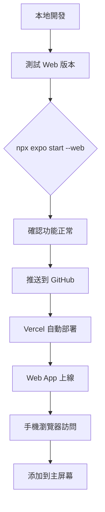

# Web App 部署方案比較與計劃

## 🆚 Vercel vs Firebase Hosting 比較

| 特性 | Vercel | Firebase Hosting |
|------|--------|------------------|
| **免費額度** | 100GB 頻寬/月 | 10GB/天 下載量 |
| **自訂網域** | ✅ 免費 | ✅ 免費 |
| **SSL 憑證** | ✅ 自動 | ✅ 自動 |
| **CDN** | ✅ 全球 Edge Network | ✅ Google CDN |
| **部署方式** | CLI 或 GitHub 自動 | CLI 或 GitHub 自動 |
| **建置時間** | 快（針對前端優化） | 中等 |
| **SPA 路由支援** | ✅ 內建 rewrites | ✅ 需設定 rewrites |
| **預覽部署** | ✅ 每個 PR 自動預覽 | ❌ 需手動設定 |
| **分析工具** | 基本分析 | Firebase Analytics 整合 |
| **後端功能** | Serverless Functions | Cloud Functions + Firestore |
| **台灣訪問速度** | ⚡ 快（亞洲節點） | ⚡ 快（Google 台灣節點） |

### 🏆 推薦：Vercel

**原因：**
1. **更簡單的配置** - 對 SPA 支援更好
2. **預覽部署** - PR 自動產生預覽網址
3. **更好的開發者體驗** - 針對前端框架優化
4. **更大的免費額度** - 100GB/月 vs 10GB/天

---


## 📋 概述

將麻將遊戲應用程式部署為 Web App 到 Vercel，實現免費、免維護的線上使用。

## ✅ 目前狀態

項目已具備基本 Web 支援：
- [`app.json`](../app.json:29-32) - 已配置 `web.bundler: metro`
- [`package.json`](../package.json:9) - 已有 `web` script

## 🔧 需要的配置變更

### 1. 安裝 Web 相關依賴

```bash
npx expo install react-native-web react-dom @expo/metro-runtime
```

### 2. 更新 app.json 的 web 配置

```json
{
  "expo": {
    "web": {
      "favicon": "./assets/favicon.png",
      "bundler": "metro",
      "output": "single"
    }
  }
}
```

### 3. 創建 Vercel 配置檔案 `vercel.json`

```json
{
  "buildCommand": "npx expo export --platform web",
  "outputDirectory": "dist",
  "framework": null,
  "rewrites": [
    { "source": "/(.*)", "destination": "/" }
  ]
}
```

## 📝 部署步驟

### 方法一：GitHub 自動部署（推薦）

1. 將代碼推送到 GitHub
2. 在 Vercel 網站上導入 GitHub 專案
3. Vercel 會自動檢測並部署

### 方法二：Vercel CLI 部署

```bash
# 安裝 Vercel CLI
npm i -g vercel

# 登入 Vercel
vercel login

# 部署
vercel --prod
```

## 🎯 部署後效果

- ✅ 免費 HTTPS 網址（如：mahjong.vercel.app）
- ✅ 全球 CDN 加速
- ✅ 自動 SSL 憑證
- ✅ 可添加到手機主屏幕（PWA）
- ✅ 不需要 Mac 運行

## ⚠️ 注意事項

1. **NativeWind Web 支援**：NativeWind v4 支援 Web，但需要確認樣式正確渲染
2. **原生功能限制**：某些 React Native 特有功能在 Web 上可能需要調整
3. **路由**：expo-router 支援 Web 路由

## 📊 工作流程圖



## 🚀 待執行的 TODO

- [ ] 安裝 react-native-web 相關依賴
- [ ] 更新 app.json web 配置
- [ ] 創建 vercel.json
- [ ] 測試 Web 版本 `npx expo start --web`
- [ ] 部署到 Vercel
